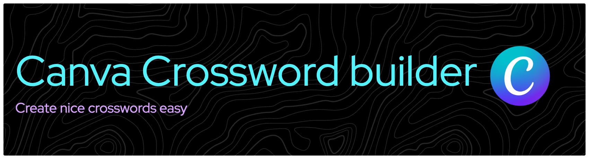
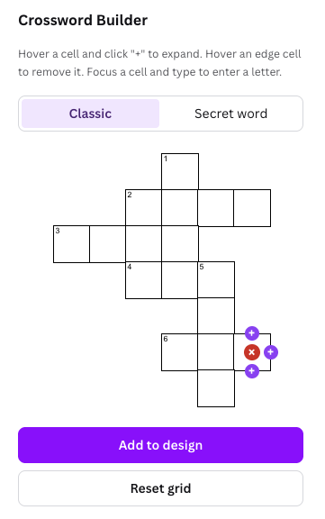
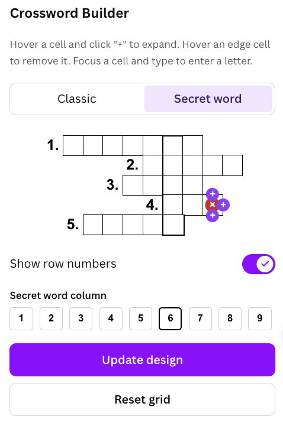
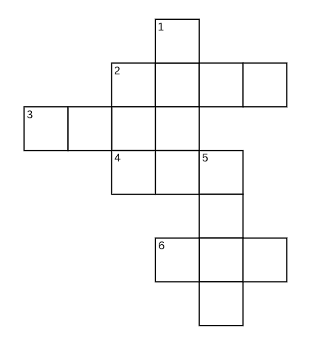
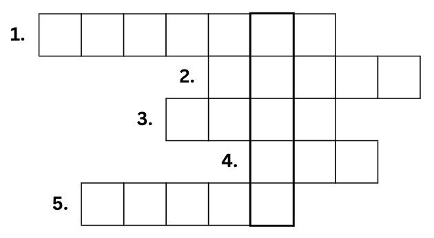

# Canva Crossword Builder

A Canva app for building crossword puzzles directly inside the Canva editor. Design your grid, fill in words and clues, and render the result onto the canvas — all without leaving Canva.

## Screenshots

| Classic Mode | Secret Word Mode |
|:---:|:---:|
|  |  |
|  |  |

## Features

- **Two modes** — Classic crossword and Secret Word (highlighted column reveals a hidden word)
- **Interactive grid editor** — click cells to toggle them on/off, type letters directly
- **Row numbers** — automatic numbering for clue references
- **Secret word column** — dedicated highlighted column in Secret Word mode
- **Canvas rendering** — one-click export of the finished crossword onto the Canva design

## Getting Started

```bash
git clone <repo-url>
cd canva-crossword
npm install
npm start
```

Then preview the app inside Canva:

1. Create an app in the [Canva Developer Portal](https://www.canva.com/developers/apps).
2. Set **App source > Development URL** to `http://localhost:8080`.
3. Click **Preview** to open the editor with the app loaded in the side panel.

## How to Use

1. **Choose a mode** — toggle between Classic and Secret Word at the top of the panel.
2. **Set grid size** — adjust the number of rows and columns.
3. **Edit the grid** — click cells to enable/disable them, then type letters into active cells.
4. **Add to design** — click the button to render the crossword onto your Canva canvas.

## Tech Stack

- [Canva Apps SDK](https://www.canva.dev/docs/apps/)
- React
- TypeScript
- webpack
